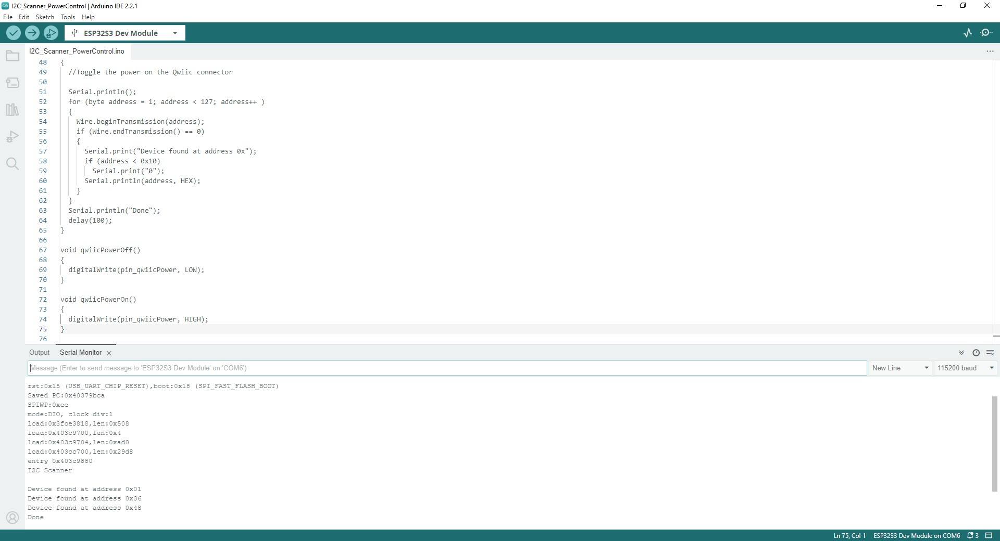

Now that we've installed the espressif boards package in Arduino, it's time to upload our first sketch to make sure everything installed and is working properly. 

## Thing Plus ESP32-S3 Github Repository

We've written a few example sketches for this specific board that live in the [Github repository](https://github.com/sparkfun/SparkFun_Thing_Plus_ESP32-S3) that we recommend taking a look at as they demonstrate some important hardware use cases. You can download it from the link above or you can get a ZIP of the library by clicking the button below:

<center>
[SparkFun Thing Plus - ESP32-S3 Github Repository (ZIP)](https://github.com/sparkfun/SparkFun_Thing_Plus_ESP32-S3/archive/refs/heads/main.zip){ .md-button .md-button--primary }    
</center>

!!! important "esptool Upload Errors"

    Some users may run into this upload error related to esptool:

    esptool.py v4.5.1
    Serial port COM33
    Connecting....

    A serial exception error occurred: Write timeout
    Note: This error originates from pySerial. It is likely not a problem with esptool, but with the hardware connection or drivers.
    For troubleshooting steps visit: https://docs.espressif.com/projects/esptool/en/latest/troubleshooting.html
    the selected serial port For troubleshooting steps visit: https://docs.espressif.com/projects/esptool/en/latest/troubleshooting.html
    does not exist or your board is not connected

    This error means the board is not entering ROM bootloader mode automatically, causing the upload to hang and fail. We found this relates specifically to esptool.py v4.5.1 in the current stable release of the ESP32 Boards Package (2.0.11). Users can work around this error with one of the following three fixes: 
    
    1. Use the alpha release (3.0.0 alpha3) of the ESP32 Boards Package. This release updates to esptool.py v4.6.
    2. Download the latest release of esptool.py from the [GitHub repository](https://github.com/espressif/esptool/releases) releases and then manually replace it in the espressif boards package folder. 
    3. If you want to keep using the current full release and encounter this error, force the board to enter the bootloader by holding the BOOT button down, clicking the RESET button, and then releasing the BOOT button.

## Board Settings

As mentioned in the previous section, the Thing Plus ESP32-S3 is not currently included in the ESP32 Boards Package so we recommend selecting "ESP32S3 Dev Module" for your board with the following settings:

* USB Mode: Hardware CDC and JTAG
* USB CDC on Boot: Enabled
* Upload Mode: UART0 / Hardware CDC
* PSRAM: QSPI PSRAM

This does require some manual definition/setup for pins in the code which the examples below demonstrate for some of the main peripheral components (Qwiic, &micro;SD card, etc.). 

## RGB LED

This example uses the FastLED library to cycle the RGB LED on the Thing Plus through a rainbow. Open the code from your downloaded copy of the GitHub repository or copy the code below into a blank sketch. Make sure the FastLED Library is installed, select the board (ESP32S3 Dev Module) and the Port, and click the "Upload" button.  

??? "RGB LED Example"
    ```

    --8<-- "https://raw.githubusercontent.com/sparkfun/SparkFun_Thing_Plus_ESP32-S3/main/Firmware/RGB_LED/RGB_LED.ino"
    ```

## I<sup>2</sup>C Scanner Power Control

This example shows how to toggle the peripheral power voltage supply on and off as well as scan for any I<sup>2</sup>C devices connected to the I<sup>2</sup>C bus/Qwiic connector. After uploading, open the [serial monitor](https://learn.sparkfun.com/tutorials/terminal-basics/arduino-serial-monitor-windows-mac-linux) with the baud set to **115200** and you should see a serial printout of the Fuel Gauge at 0x32 as well as any other devices connected to the Qwiic connector like the screenshot below shows. If you have a Qwiic board plugged in you should see the power LED on it blinking every second as the bus is powered on and off.

??? "I2C Scanner Power Control Example"
    ```

    --8<-- "https://raw.githubusercontent.com/sparkfun/SparkFun_Thing_Plus_ESP32-S3/main/Firmware/I2C_Scanner_PowerControl/I2C_Scanner_PowerControl.ino"
    ```

<figure markdown>
[{ width="600"}](./assets/img/I2C_Scanner_Output.jpg "Click to enlarge")
</figure>

## SD Card Detect

The SD Card Detect example is a simple example that monitors the card detect pin on the &micro;SD card slot. As mentioned in the Hardware Overview section, the card detect switch is normally open and closed with a card inserted so the switch goes to VDD (3.3V). This requires us to set up an internal pull-down for card detection to work properly. 

After uploading, you can open the serial monitor with the baud set to **115200** and it should print out either "Card Inserted" or "No SD Card" depending on whether or not a &micro;SD card is present.

??? "SD Card Detect Example"
    ```

    --8<-- "https://raw.githubusercontent.com/sparkfun/SparkFun_Thing_Plus_ESP32-S3/main/Firmware/SD_Card_Detect/SD_Card_Detect.ino"
    ```

## PSRAM Test

This example demonstrates how to enable and use PSRAM for RAM requests above a 1,000 byte threshold. The setup initializes PSRAM and prints out whether or not this was successful and then prints out available PSRAM space.

??? "PSRAM Test Example"
    ```

    --8<-- "https://raw.githubusercontent.com/sparkfun/SparkFun_Thing_Plus_ESP32-S3/main/Firmware/PSRAM_Test/PSRAM_Test.ino"
    ```
