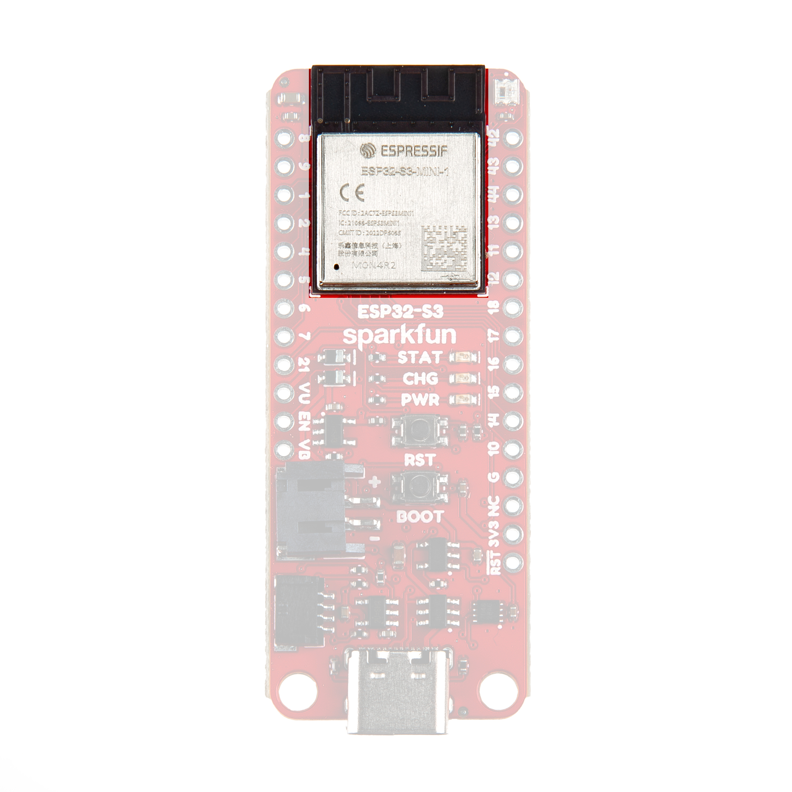
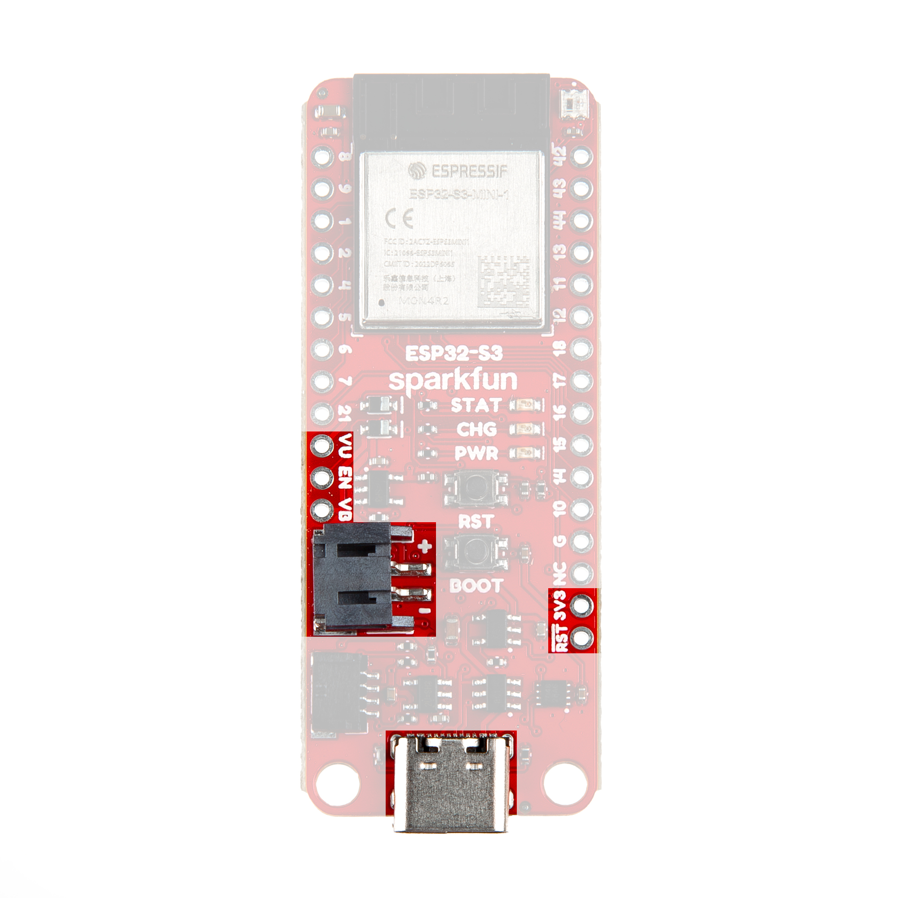
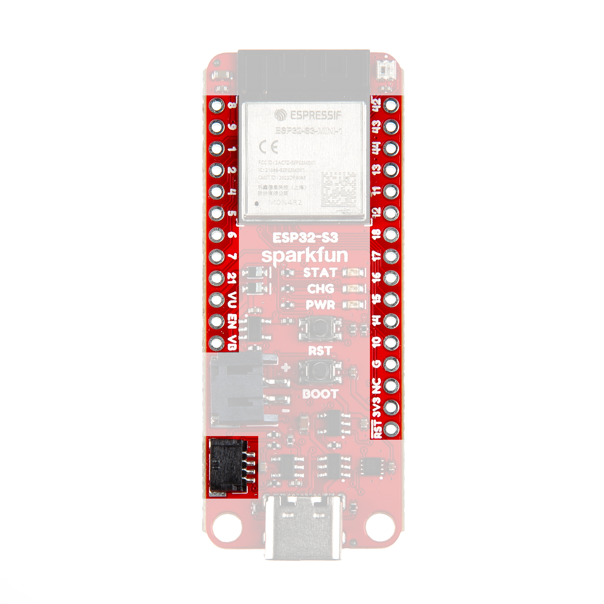
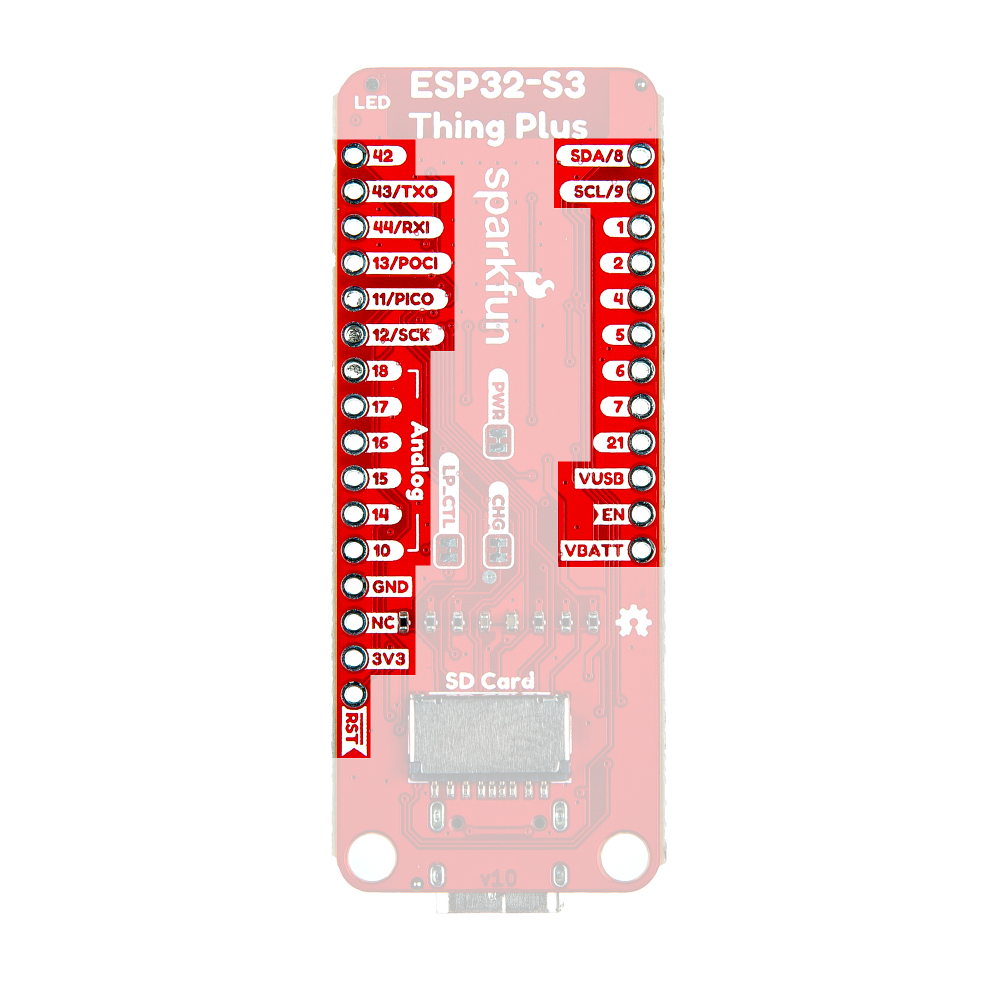
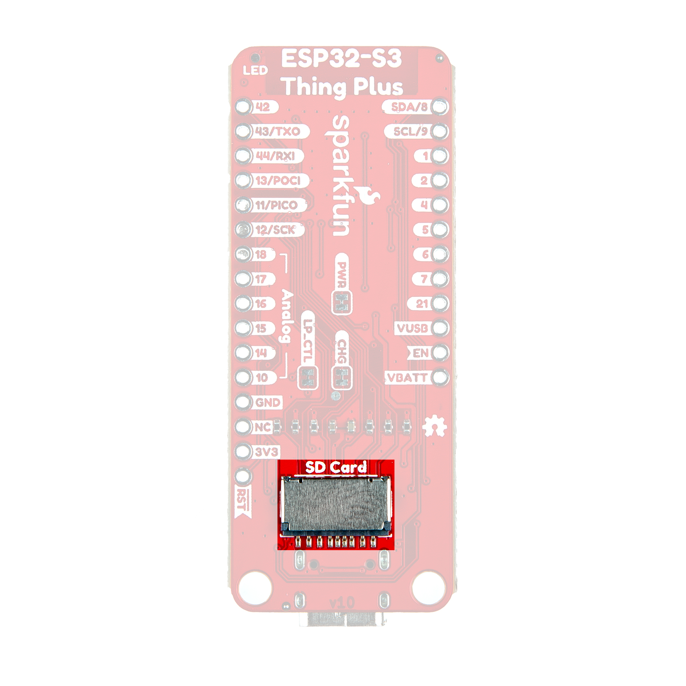
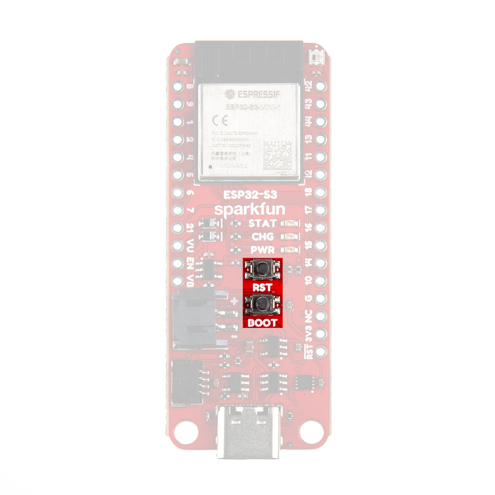
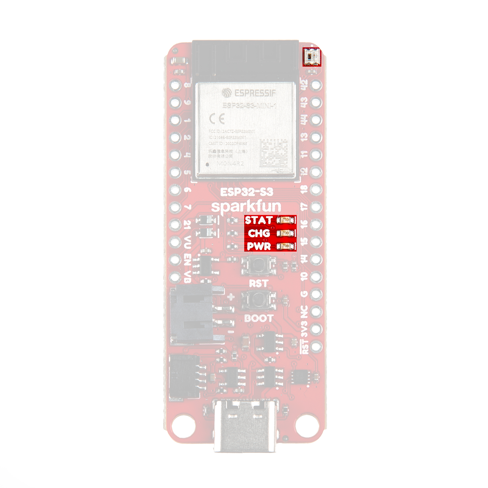
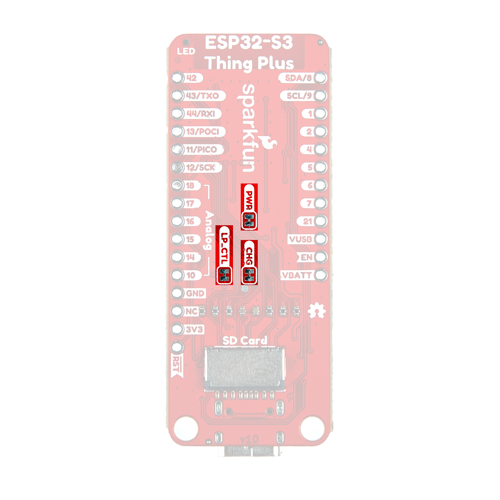
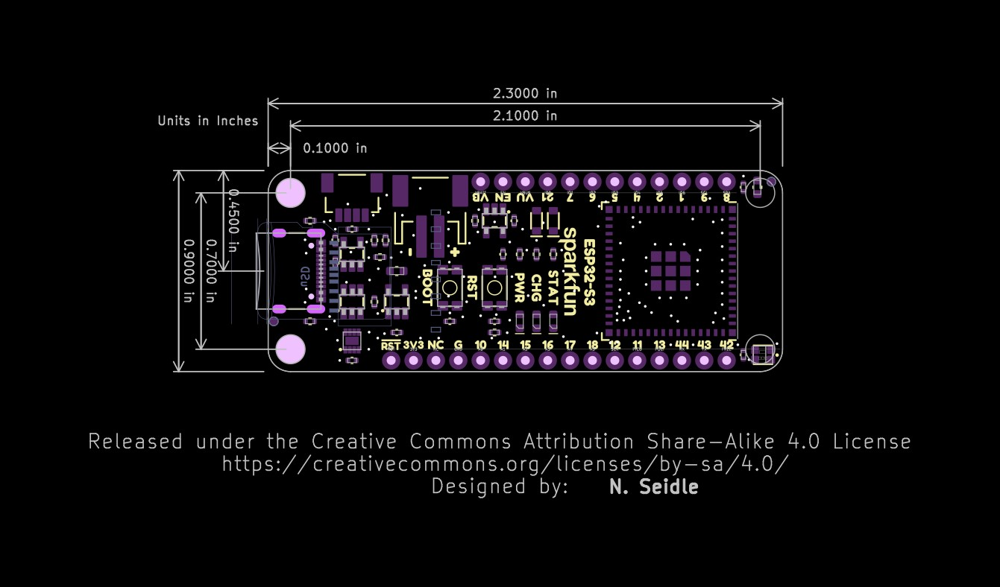

Let's take a closer look at the ESP32-S3 module and other hardware present on this Thing Plus board.

## ESP32-S3 Module

This Thing Plus uses the ESP32-S3-MINI1 wireless module from espressif. The ESP32-S3 is built around the extremely powerful Xtensa&reg; dual-core 32-bit LX7 microprocessor with a wireless stack that supports 2.4 GHz WiFi and Bluetooth&reg; 5 (LE) with an integrated PCB antenna.

<figure markdown>
[{ width="600"}](./assets/img/Thing_Plus_ESP32S3-Module.jpg "Click to enlarge")
</figure>

The ESP32-S3-MINI1 offers an impressive peripheral features set including UART, I2C, I2S, SPI, LCD, Camera Interface, LED PWM, SDIO host, two-wire automotive interface (TWAI&reg;) that is compatible with ISO 11898-1/CAN Spec 2.0 and more. This Thing Plus uses the ESP32-S3-MINI1-N4R2 which features 4MB Quad SPI Flash memory and 2MB of PSRAM (Pseudo-static RAM). The ESP32-S3 also has a full-speed USB 2.0 On-The-Go (OTG) interface for USB communication so it does not need any external UART-to-USB conversion.

## Power Components

The Thing Plus ESP32-S3 includes several options for powering including USB-C, LiPo battery with on-board battery charging and monitoring circuits as well as direct power inputs.

<figure markdown>
[{ width="600"}](./assets/img/Thing_Plus_ESP32S3-Power.jpg "Click to enlarge")
</figure>

### USB-C Connector

The USB-C connector on the board acts as the primary serial interface for the ESP32-S3 module as well as a power input. It connects directly to the ESP32-S3's USB serial converter. The <b>5V</b> USB input voltage is regulated down to <b>3.3V</b> through a voltage regulator with a max current of <b>500mA@3.3V</b>.

### 2-Pin JST Connector, Battery Charger, & Fuel Gauge

The board has a 2-pin JST connector to connect a single-cell Lithium Ion (LiPo) battery for battery-powered applications. It also has an MCP73831 battery charger to charge an attached battery and a MAX17048 fuel gauge to monitor battery voltage levels. The charge rate is set to <b>214mA@3.3V</b>. The MCP73831 receives power from the V_USB line so it only is powered when <b>5V</b> is provided either over USB or the V_USB PTH pin. If applying voltage directly to the V_USB pin make sure it does not exceed <b>5.5V</b>.

The MAX17048's I2C lines are pulled up to <b>3.3V_P</b> to allow for customizable power options. Read on below for more information about peripheral power.

## Peripheral Power Control

The board includes a second RT9080 3.3V regulator to control power to the peripheral 3.3V (3.3V_P) rail. This is powered on by default with some options for user control to help conserve power. The RT9080's EN (Enable) pin is tied to ESP45 so users can drive it LOW in their code to disable this line. It also is tied to the main 3.3V rail through the <b>LP_CTL</b> solder jumper so it defaults to powered on. If this solder jumper is opened, it defaults to off when the ESP32-S3 is power-cycled though users can drive the ESP45 pin HIGH in their code to enable the 3.3V_P rail.

## Pinout & Qwiic Connector

Thing Plus boards break out a large number of GPIO and interface pins to a pair of 0.1"-spaced plated through-hole (PTH) headers and also has a Qwiic connector for easy integration into SparkFun's [Qwiic ecosystem](https://www.sparkfun.com/qwiic).

<figure markdown>
[{ width="600"}](./assets/img/Thing_Plus_ESP32S3-QwiicPTHs.jpg "Click to enlarge")
</figure>

### Qwiic Connector

The Qwiic connector is tied to the ESP32-S3's I2C bus (IO8/SDA and IO9/SCL). The Qwiic connector provides connections for SDA, SCL, 3.3V, and Ground. Note, the Qwiic connector power and I2C pins are tied to 3.3V_P and are powered by default but if the peripheral power control circuit is adjusted as covered above, it will not function properly without enabling 3.3V_P through code.

### PTH Headers

The Thing Plus's pair of PTH headers break out a selection of 21 GPIO pins from the ESP32-S3 along with PTH connections to USB voltage (5V), regulated 3.3V, battery voltage, ESP32 reset signal, and the voltage regulator Enable pin.

<figure markdown>
[{ width="600"}](./assets/img/Thing_Plus_ESP32S3-PTHs.jpg "Click to enlarge")
</figure>

Nearly all of the GPIO pins can function in multiple configurations though some of them have more capabilities than others and some are limited to fewer functions. Pins labeled 10, 14, 15, 16, 17, and 18 are all analog capable and also work as capacitive touch inputs. The pins labeled for UART (RX/TX), I2C (SDA/SCL), and SPI (POCI, PICO, & SCK) work primarily for their labeled functions but can be altered for other uses. Refer to the [datasheet](./assets/component_documentation/esp32-s3-mini-1_mini-1u_datasheet_en.pdf) datasheet for complete information on the pin functionality.

## &micro;SD Card Slot

The board has a &micro;SD card slot that connects to the ESP32-S3's SDIO-4 pins. It is a fricton-fit connector so no "clicking" and "unclicking" is necessary. Just plug it in nice and snug. 

<figure markdown>
[{ width="600"}](./assets/img/Thing_Plus_ESP32S3-microSD.jpg "Click to enlarge")
</figure>

We chose to connect the SD card to the SDIO interface instead of the dedicated SPI bus as we found it to be reliably faster for read/write speeds averaging roughly 2-3MB/s (read) and ~5-7MB/s (write) though speeds vary depending on the card used. One thing to note about this connector is the SD Card Detect pin is pulled to Ground (LOW) with no card present and shorts to 3.3V (HIGH) with a card inserted. Read on to the "Arduino Examples" section for an example of how to monitor and read this pin.

## Buttons

There are two buttons on the board labeled <b>RESET</b> and <b>BOOT</b>. The RESET button is tied to the ESP32-S3's Enable (EN) pin and resets the module when pressed. The BOOT button puts the ESP32-S3 into bootloader mode when held down during power on or reset.

<figure markdown>
[{ width="600"}](./assets/img/Thing_Plus_ESP32S3-Buttons.jpg "Click to enlarge")
</figure>

## LEDs

This Thing Plus has three standard LEDs labeled <b>PWR</b>, <b>CHG</b>, <b>STAT</b>, and a WS2812 RGB LED next to the ESP32-S3 module on the top of the board. The red Power (PWR) LED indicates whenever the <b>3.3V</b> circuit is powered. The yellow Charge (CHG) LED indicates whenever the MCP73831 is charging a connected LiPo battery. The green Status (STAT) LED is tied to IO0. The WS2812 RGB LED connects the LED's Data In signal to IO46.

<figure markdown>
[{ width="600"}](./assets/img/Thing_Plus_ESP32S3-LEDs.jpg "Click to enlarge")
</figure>

## Solder Jumpers

The board has three solder jumpers labeled <b>PWR</b>, <b>CHG</b>, and <b>LP_CTL</b>. The <b>PWR</b> jumper completes the circuit for the Power LED and is CLOSED by default. Open it to disable the Power LED. The <b>CHG</b> jumper completes the circuit for the Charge LED and is CLOSED by default. Open the solder jumper to disable the Charge LED.

<figure markdown>
[{ width="600"}](./assets/img/Thing_Plus_ESP32S3-Jumpers.jpg "Click to enlarge")
</figure>

The <b>LP_CTL</b> jumper controls how the Low Power and Peripherals power works. It is CLOSED by default to pull the power the RT9080 3.3V regulator's enable pin HIGH to enable peripheral power on the <b>3.3V_P</b> rail. When opened, the regulator's enable pin connects directly to ESP32 IO45 for users to control manually. Refer to "Peripheral Power Control" above for more information.

## Board Dimensions

This board matches the Thing Plus footprint and measures 2.30" x 0.90" (58.42mm x 22.86mm) with four mounting holes that fit a [4-40 screw](https://www.sparkfun.com/products/10453) though the top two mounting holes are slightly obstructed by the ESP32-S3 module so using those can be a bit troublesome.

<figure markdown>
[{ width="600"}](./assets/board_files/SparkFun_Thing_Plus_ESP32-S3-Dimensions.jpg "Click to enlarge")
</figure>
